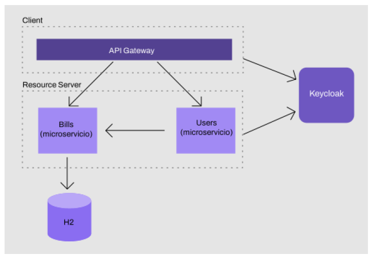

# SecurityIAMKeycloak
Proyecto evaluativo, llevado a cabo en la materia Especialización en Backend 2, dónde pusimos en práctica los conocimientos aprendidos sobre el Identity Access Management Keycloak. 

## Table of Contents
1. [Información general](#general-info)
2. [Tecnologías](#technologies)

### Información general
***
Proyecto creado en arquitectura de microservicios para un e-commerce con aplicación de seguridad.
Partimos de un proyecto base en el cual nos proporcionan ms-bills y ms-discovery sin configuraciones de seguridad aplicadas.

- Los microservicios del proyecto son:
    - ms-gateway: que utilizaremos junto con aplicación de seguridad para restringir el acceso a nuestra información. Con el protegemos el uso y la integridad de nuestra API.
    - ms-bills: encargado de gestionar facturas.
    - ms-discovery: encargado del registro y descubrimiento de los microservicios del proyecto.
    - ms-users: encargado de gestionar usuarios. Se comunicará con ms-bills utilizando Feign y con Keycloak REST Admin Client, nos autenticaremos y obtendremos el token de Keycloak al enviar la petición.

- Aplicación de seguridad con IAM Keycloak
    - En Keycloak creamos:
        - un reino (eb2)
        - un cliente con flujo de autorización authorization_code (api-gateway-client) y otro cliente con flujo client_credentials (users-service-client); 
        - un rol USER;
        - 6 usuarios: 
            - USER - con rol de cliente USER, compuesto ("user" y "app_user"). 
            - USER2 - sin grupo ni rol asignados. 
            - USER3 - sin rol; de grupo PROVIDERS. 
            - USER4 - con rol de reino APP_USER; de grupo PROVIDERS. 
            - USER5 - sin grupo ni rol asignados. 
            - USER6 - sin grupo ni rol asignados. 
        - un grupo PROVIDERS al que le asignamos algunos usuarios ya creados. 
        *(más información detallada en /configs-keycloak/notas-keycloak.txt)*
    - En ms-gateway, ms-bills y ms-users restringimos el consumo de las APIs solo a usuarios **autenticados**.
    - En ms-bills agregamos un JWTConverter personalizado para obtener roles, grupos y scope del JWT y hacer restricciones: 
        - solo usuarios con rol USER pueden obtener el listado completo de facturas.
        - solo usuarios pertenecientes a grupo PROVIDERS podrán crear facturas.
        - solo usuarios autenticados pueden buscar facturas por ID de usuario.
    - En ms-users buscaremos usuarios por ID utilizando Keycloa REST admin client.

- ENDPOINTS: 
    - obtener todas las facturas: /api/v1/bills/all
    - buscar facturas por id de usuario: /api/v1/bills/users/{id}
    - crear facturas: /api/v1/bills/users/create
    - buscar un usuario y sus facturas: /api/v2/users/find/{id} 

### Screenshot

## Technologías
***
Lista de tecnologías usadas en el proyecto:
* [Java](https://www.java.com/es/): Version 17.0.1
* [SpringFramework](https://spring.io): Version 2.7.0 
- Dependencias POM:
* [spring-boot-starter-data-jpa]
* [spring-cloud-starter-netflix-eureka-server]
* [spring-cloud-starter-netflix-eureka-client]
* [spring-boot-starter-oauth2-resource-server]
* [spring-security-oauth2-client]
* [keycloak-admin-client]
* [spring-boot-starter-actuator]
* [spring-cloud-starter-gateway]
* [spring-boot-starter-webflux]
* [spring-cloud-starter-openfeign]

